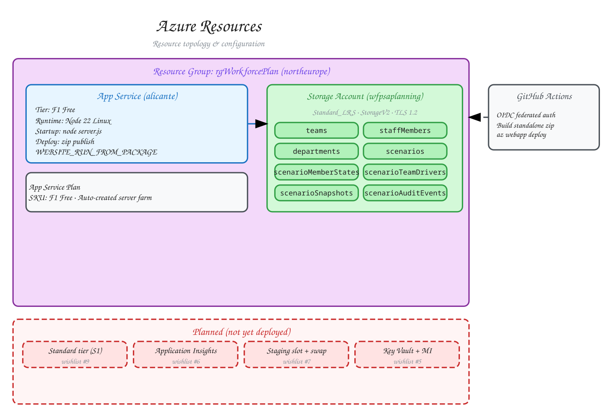

# Azure Resources

Cloud resource inventory, topology, and configuration for Workforce Planning.

## Diagram



**[Edit in Excalidraw](./azure-resources.excalidraw)** — open at [excalidraw.com](https://excalidraw.com)

## Current Topology

```
┌─────────────────────────────────────────────────────┐
│  Resource Group: rgWorkforcePlan (northeurope)      │
│                                                     │
│  ┌─────────────────┐    ┌────────────────────────┐ │
│  │  App Service    │    │  Storage Account       │ │
│  │  (alicante)     │───→│  Standard_LRS          │ │
│  │  F1 Free tier   │    │  Table Storage         │ │
│  │                 │    │                        │ │
│  │  Node 22        │    │  Tables (8):           │ │
│  │  standalone     │    │    teams, staffMembers,│ │
│  │  WEBSITE_RUN_   │    │    departments,        │ │ │
│  │  FROM_PACKAGE   │    │    scenarios,          │ │ │
│  │                 │    │    scenarioMemberStates│ │ │
│  └─────────────────┘    │    scenarioTeamDrivers │ │ │
│          ↑               │    scenarioSnapshots   │ │ │
│          │               │    scenarioAuditEvents │ │ │
│  ┌───────┴──────────┐    └────────────────────────┘ │
│  │  GitHub Actions  │         ↑                     │
│  │  (OIDC deploy)   │─────────┘ (connection string  │
│  │                  │          set as app setting)  │
│  └──────────────────┘                               │
└─────────────────────────────────────────────────────┘
```

## Resource Inventory

| Resource | Type | Name | Tier | Purpose |
|----------|------|------|------|---------|
| Resource Group | `Microsoft.Resources/resourceGroups` | `rgWorkforcePlan` | — | Container for all resources |
| App Service | `Microsoft.Web/sites` | `alicante` | F1 Free | Next.js standalone runtime |
| App Service Plan | `Microsoft.Web/serverfarms` | (auto) | F1 Free | Hosting plan for App Service |
| Storage Account | `Microsoft.Storage/storageAccounts` | `wfpsaplanning` | Standard_LRS | Table Storage (all data) |

Infrastructure is defined in Bicep under `infra/`:

```
infra/
├── main.bicep                      # Entry point — orchestrates modules
├── parameters.json                 # Deployment parameter values
├── create_tableaccess.sh           # CLI script for table access setup
└── modules/
    ├── app-service.bicep           # App Service resource + app settings
    ├── app-service-plan.bicep      # Server farm (SKU/tier)
    └── storage.bicep               # Storage account + connection string output
```

## App Service Configuration

| Setting | Value | Notes |
|---------|-------|-------|
| Runtime | Node.js 22 | Linux container |
| Startup command | `node server.js` | Next.js standalone output |
| Deploy method | zip publish | `az webapp deploy --type zip` |
| `WEBSITE_RUN_FROM_PACKAGE` | (set during deploy) | Enables run-from-zip |
| `AZURE_STORAGE_CONNECTION_STRING` | connection string | App setting, not shell-exported |
| `NODE_ENV` | `production` | Set at deploy time |
| `NEXT_TELEMETRY_DISABLED` | `1` | Reduces noise |
| `PORT` | `8080` | Internal port |

The deploy pipeline (`.github/workflows/deploy.yml`) builds the standalone
output, creates a zip, and deploys via `az webapp deploy`. The previous
10-year SAS token / blob Run-From-Package path has been removed (wishlist #8).

## Storage Account Configuration

| Setting | Value |
|---------|-------|
| Kind | StorageV2 |
| SKU | Standard_LRS (locally redundant) |
| Access tier | Hot |
| Minimum TLS | TLS 1.2 |
| Public blob access | Disabled |
| HTTPS only | Enabled |

Connection string is resolved via `listKeys()` in Bicep and passed to the App
Service as an application setting. Locally, `UseDevelopmentStorage=true`
targets Azurite.

## Target Architecture (planned, not yet deployed)

The following are defined in `.planning/azure-rebuild-plan.md` but not yet
provisioned. They are wishlist items, not live resources:

| Planned resource | Wishlist item | Status |
|-----------------|---------------|--------|
| App Service Plan → Standard (S1) | #9 | Not started |
| Always On enabled | #9 | Not started |
| Application Insights | #6 | Not started |
| Staging slot + swap pipeline | #7 | Not started |
| Key Vault + Managed Identity | #5 | Not started |

## Local Development Parity

| Concern | Local | Production |
|---------|-------|-----------|
| Table Storage | Azurite (`UseDevelopmentStorage=true`) | Azure Storage (`AZURE_STORAGE_CONNECTION_STRING`) |
| Node version | 22 (local) | 22 (App Service) |
| Build output | `.next/` (dev server) | `.next/standalone/` (zip) |
| Seed data | `npm run dev:seed` | Not available (production guard blocks reset) |

Local dev starts Azurite (`npm run azurite`) then the Next.js dev server
(`npm run dev`), or both together (`npm run dev:full`). The storage client
auto-detects local vs. production from the connection string and adjusts retry
policy accordingly.
