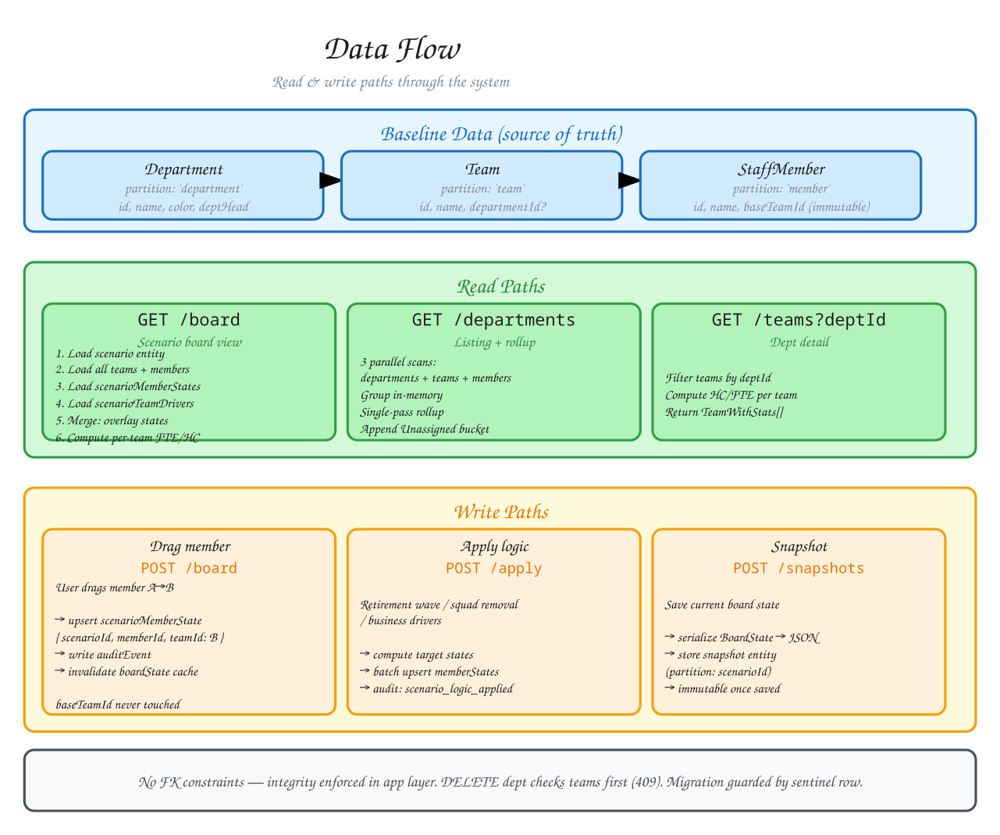

# Data Flow

How data moves through Workforce Planning — read paths, write paths, and the
scenario engine that transforms baseline staff data into modeled states.

## Diagram



**[Edit in Excalidraw](./data-flow.excalidraw)** — open at [excalidraw.com](https://excalidraw.com)

## Baseline Data (the source of truth)

Three tables hold immutable baseline data — they represent the real-world org:

```
departments (partition: 'department')
    ↓ departmentId (optional)
teams (partition: 'team')
    ↓ baseTeamId (immutable)
staffMembers (partition: 'member')
```

- **Departments** group teams. Each team carries an optional `departmentId`.
  Teams without one appear in an "Unassigned" bucket.
- **Teams** are the organizational units.
- **StaffMembers** carry `baseTeamId` — this is immutable and never changes,
  even when a scenario moves a member to a different team.

## Read Paths

### Board state (the main scenario view)

```
GET /api/scenarios/[id]/board
  → getBoardState(scenarioId)
    → load scenario entity
    → load all teams (baseline)
    → load all staffMembers (baseline)
    → load scenarioMemberStates (partition: scenarioId)
    → load scenarioTeamDrivers (partition: scenarioId)
    → merge: for each member, overlay scenarioState on baseline
    → group by teamId (from scenarioState, or baseTeamId if no state)
    → compute per-team FTE/headcount
    → return BoardState { scenario, teams[], removedMembers[], totals }
```

The board state is computed in-memory — there is no stored "board" table. It
is always derived from baseline + scenario overrides on every request.

### Department listing with rollup

```
GET /api/departments
  → getDepartmentsWithStats()
    → 3 parallel partition scans: departments, teams, members
    → group members by baseTeamId
    → group teams by departmentId
    → single pass: sum headcount + FTE per department
    → append Unassigned bucket if unassigned teams exist
```

This is a single-pass computation over three parallel scans — not N+1 queries.

### Department detail

```
GET /api/teams?departmentId=X
  → filter teams by departmentId
  → for each team, compute headcount + FTE from staffMembers
  → return TeamWithStats[]
```

## Write Paths

### Member drag-and-drop (the core interaction)

```
User drags member from Team A → Team B
  → useMoveMembers(scenarioId).mutate({ memberId, fromTeamId, toTeamId })
    → POST /api/scenarios/[id]/board { memberId, fromTeamId, toTeamId }
      → upsert scenarioMemberState { partition: scenarioId, rowKey: memberId, teamId: toTeamId }
      → write auditEvent { eventType: 'member_moved', memberId, fromTeamId, toTeamId }
    → TanStack Query invalidates ['boardState', scenarioId]
    → board re-renders with new arrangement
```

The member's `baseTeamId` in `staffMembers` is never touched. The scenario
state is a separate overlay. This means a scenario reset is trivially just
"delete all scenarioMemberStates for this scenario."

### Scenario logic application

When the user clicks "Apply Logic" (retirement wave, squad removal, or
business drivers):

```
POST /api/scenarios/[id]/apply
  → applyScenarioLogic(scenarioId, params)
    → read scenario type + parameters
    → read current board state
    → based on type:
        - retirement_wave → mark eligible members as 'removed'
        - squad_removal → mark entire squads as 'removed'
        - business_drivers → adjust FTE via driver targets
    → write batch of scenarioMemberStates
    → write auditEvent { eventType: 'scenario_logic_applied' }
```

### Snapshot save/restore

```
Save:  POST /api/scenarios/[id]/snapshots
  → serialize current BoardState → boardStateJson
  → serialize scenario parameters → parametersJson
  → store as snapshot entity (partition: scenarioId)

Restore: POST /api/scenarios/[id]/snapshots/[snapId]/restore
  → read snapshot entity
  → deserialize boardStateJson
  → overwrite all scenarioMemberStates + scenarioTeamDrivers
  → write auditEvent { eventType: 'snapshot_restored' }
```

Snapshots are the only place a full board state is persisted as a unit. They
are immutable once saved.

## Data integrity model

Azure Table Storage has no foreign keys, transactions (within a partition), or
cascading deletes. Integrity is enforced in the application layer:

| Concern | How it's enforced |
|---------|------------------|
| Orphaned departmentId on teams | DELETE department checks assigned teams first (409 if any) |
| Orphaned teamId on members | Not enforced — `baseTeamId` is a soft reference |
| Duplicate migration runs | Sentinel row pattern (`v2-departments-migration-sentinel`) |
| Scenario state for deleted members | Accepted risk — state rows outlive their member silently |
| Snapshot consistency | Accepted risk — snapshots capture a point-in-time; later baseline changes don't backfill |

## Entity relationship

```
Department ──< Team ──< StaffMember (baseTeamId)
     │            │
     │            └──< ScenarioTeamDriver (per scenario)
     │
     └── rollup stats computed in-memory (no stored FK)

Scenario ──< ScenarioMemberState (overlays StaffMember's team assignment)
         ──< ScenarioTeamDriver
         ──< Snapshot
         ──< AuditEvent
```

All scenario-scoped entities use `scenarioId` as their partition key, enabling
efficient partition-scanned queries for a single scenario.
