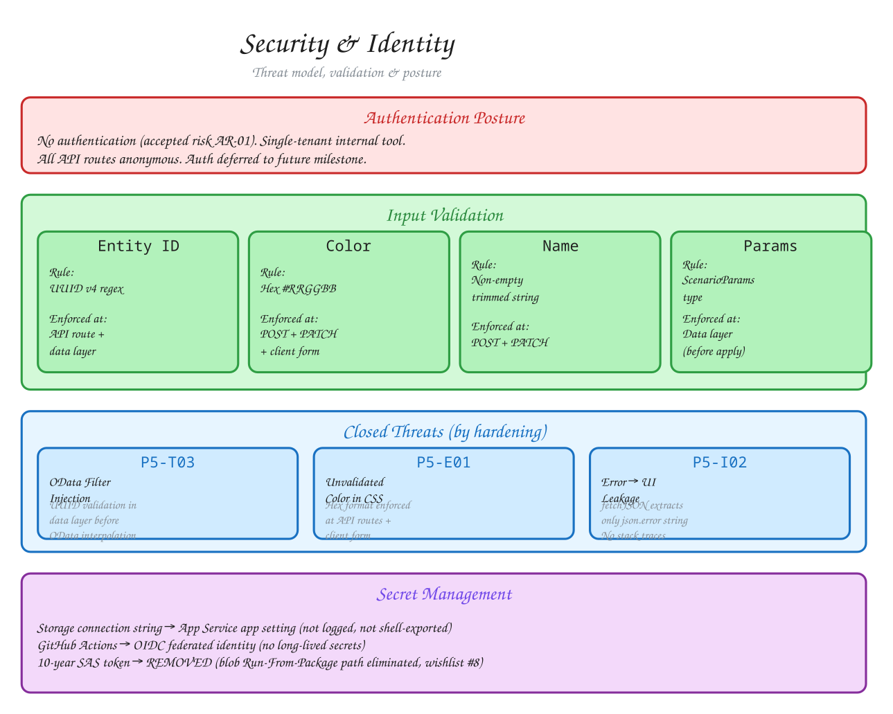

# Security & Identity

Threat model, authentication posture, input validation, and accepted risks for
Workforce Planning.

## Diagram

**[Edit in Excalidraw](./security-identity.excalidraw)** — open at [excalidraw.com](https://excalidraw.com)

## Authentication Posture

Authentication is implemented using **Auth.js (NextAuth v5)** with the
**Microsoft Entra ID** (single-tenant) OIDC provider. The session strategy
is JWT — a signed, httpOnly cookie stores the session statelessly (no
database session store).

All application routes are protected by Auth.js middleware
(`src/middleware.ts`): unauthenticated requests are redirected to `/login`.
The following paths are excluded from the middleware matcher:
`/api/auth/*` (OAuth callback), `/_next/*` (static assets), and static
file extensions.

API routes (e.g. `/api/scenarios`) are also protected — the middleware
runs before the route handler. Client-side `fetchJSON` redirects to
`/login` on 401 responses.

| Aspect | Current state | Rationale |
|--------|--------------|-----------|
| Authentication | Entra ID (OIDC, single-tenant) via Auth.js | All users must authenticate with their Microsoft account (wishlist #25–#27) |
| Session | JWT (httpOnly cookie) | Stateless — no DB session store needed |
| Per-department access control | None | All authenticated users can access all departments (AR-02) |
| Transport security | HTTPS (App Service) | Azure App Service terminates TLS |
| Data encryption at rest | Azure Storage default | Standard_LRS with platform-managed keys |

## STRIDE Threat Model

Based on the Phase 5 security audit (`/SECURITY.md`). ASVS level 1 (internal
single-tenant, no auth by design).

### Closed threats

| ID | Category | What was done |
|----|----------|--------------|
| P5-S01/S02 | Spoofing | **Resolved** — Entra ID (OIDC) authentication via Auth.js now enforced on all routes (wishlist #25–#27) |
| P5-T01/T02 | Tampering | **Resolved** — all mutations now require an authenticated session |
| P5-T03 | Tampering (OData injection) | **Mitigated** — UUID validation (`assertValidId`) now enforced in the data layer before `id` reaches OData filters in `deleteDepartment`, `getDepartmentById`, `updateDepartment` |
| P5-R01 | Repudiation | Department mutations lack audit trail — accepted (future scope) |
| P5-I01/I03 | Info Disclosure | 404 enumeration + 409 count — accepted (internal context) |
| P5-I02 | Info Disclosure (error→UI) | `fetchJSON` extracts only `json.error` string — no stack traces, no `dangerouslySetInnerHTML` |
| P5-D01 | Denial of Service | Full table scans accepted — small dataset, no SLA |

### Closed by hardening work

| ID | Mitigation |
|----|-----------|
| P5-T03 (OData filter injection) | UUID regex validation enforced in `src/lib/api/departments.ts` — `assertValidId()` is called at the data-layer entry point of every function that accepts an external `id` and interpolates it into an OData filter. |
| P5-E01 (unvalidated color in inline CSS) | Hex color validation (`/^#[0-9A-Fa-f]{6}$/`) enforced at both API routes (`POST`, `PATCH`) and the client form (`DepartmentForm.tsx`). Invalid colors are rejected with 400 / submit-button disabled. |

## Input Validation

| Input | Validation | Enforced at |
|-------|-----------|-------------|
| Department/Team ID (URL path) | UUID v4 regex | API route handlers + data layer (`assertValidId`) |
| Color (department) | Hex color `#RRGGBB` | API routes (POST + PATCH) + client form |
| Name (department) | Non-empty trimmed string | API routes (POST + PATCH) |
| Scenario parameters | Validated against `ScenarioParams` type | Data layer before apply |

Validation happens at two layers:
1. **API route** — early 400/404 return for malformed input (HTTP boundary)
2. **Data layer** — `assertValidId` as defense-in-depth before OData interpolation

## Secret Management

| Secret | Storage | Exposure |
|--------|---------|----------|
| Storage connection string | App Service application setting | Not logged, not shell-exported in CI |
| Azure credentials (CI) | GitHub Actions OIDC | Federated identity, no long-lived secrets |
| Auth.js `AUTH_SECRET` | App Service application setting / `.env.local` | Used to sign session JWT; not logged |
| Entra ID client secret | App Service application setting / `.env.local` | Used for OIDC token exchange; not logged |
| ~~10-year SAS token~~ | **Removed** | Previous blob Run-From-Package path eliminated (wishlist #8) |

**What CI does NOT touch:** The deploy workflow no longer parses or echoes the
storage connection string. It deploys via `az webapp deploy` (zip publish) and
the connection string lives only as an App Service setting set separately.

## Accepted Risks Register

| ID | Risk | Review date |
|----|------|-------------|
| AR-01 | ~~No authentication on any API route~~ **Resolved** — Entra ID + Auth.js implemented (#25–#27) | Resolved 2026-07-08 |
| AR-02 | No per-department access control | 2026-Q4 |
| AR-03 | No audit trail for department PATCH/DELETE | 2027-Q1 |
| AR-04 | Full table scans on every request | 2026-Q4 |
| AR-05 | Department ID enumeration via 404 | 2027-Q1 |

## Planned Security Improvements

From the wishlist and `.planning/2026-06-28-drone-findings.md`:

| Improvement | Wishlist | Status |
|-------------|----------|--------|
| Content-Security-Policy header (restrict `style-src`) | Recommended (not yet tracked) | Partially done — CSP allows Entra ID login flow |
| Key Vault + Managed Identity for storage access | #5 | In progress |
| Azure Table Storage query path audit | #4 | Open |
| Error swallowing fix in `db/client.ts` (lines 38-52) | Recommended | Open |
| Node LTS exact pinning in CI/runtime | #5 / #9 | Open |
